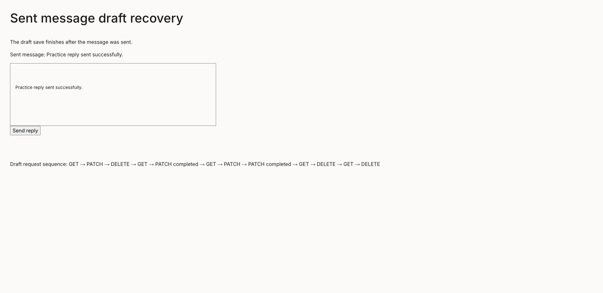
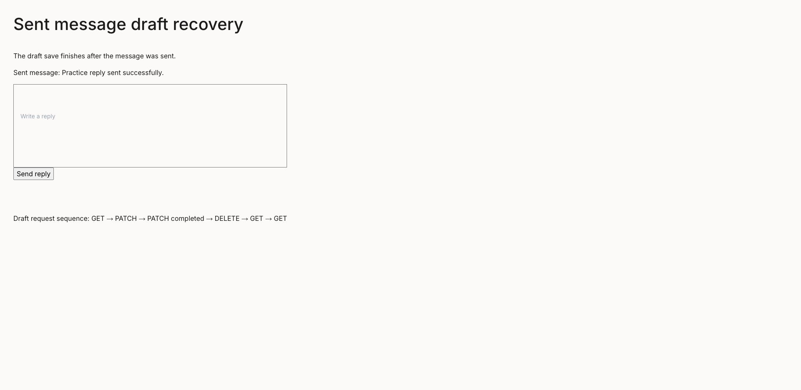

# Sent drafts can return after a delayed save

Related to #1681. A draft save already on the wire can finish after a successful message send deletes the draft. Re-enabling the draft hook can then load the sent text back into the composer. The historical practice-mode report itself was not reproduced in the unchanged practice flow; this patch addresses the independently reproduced draft ordering race.

## Change

`useDraftMessage` tracks outstanding content upserts and waits for them to settle before deleting a sent draft. A save whose clear generation changed also skips its draft-index update. Clearing local composer content still happens immediately in the production composer.

The new unit regression delays the outgoing draft PATCH until after clearing starts. The `DraftSendRace` Storybook harness uses the real draft hook and TipTap editor with an isolated in-memory HTTP endpoint, a synthetic 500 ms initial load, 250 ms PATCH, and the composer's 1200 ms request reset. It demonstrates a synthetic transport timing race, not a live Matrix/backend or the original practice report. Existing practice-flow stories now assert the team and client composer become empty after sending.

## Verification

Environment: local only, Node 22, real Chromium for Storybook. No deployed image or live backend was used.

- Baseline unit: new race fails; existing 15 draft tests pass.
- Fixed unit: all 16 draft tests pass.
- Baseline synthetic browser story: fails with sent text still present after request reset.
- Unchanged practice flow with stronger editor assertions: 4/4 browser stories pass; original historical symptom remains unconfirmed.
- Full unit: 701 files, 12306 tests pass.
- `npm run lint:scripts`: pass.
- `npm run lint:style`: pass.
- `npm run build` and hardcoded deployment value scan: pass.

- Final browser coverage: 5/5 stories pass (synthetic race plus four practice flows).
- `npm run typecheck:storybook`: pass.

Visual proof uses the isolated synthetic timing fixture. The before screenshot shows the sent text restored into the editor after the delayed PATCH; the after screenshot shows the same sent sample above an empty editor, with PATCH completion preceding DELETE. The temporary baseline hook is not part of the delivery.

## Scope and security review

No message content is moved into notifications, logs, storage scopes, or an additional service. Existing privacy and scope boundaries remain in force. Outstanding promise tracking is per mounted hook; the clear generation retires stale index writes. The Storybook endpoint stays in memory and restores its fetch interception on unmount, including StrictMode remounts. Parent independent production review passed the write ordering and generation checks.

## Reviewer steps

Run the `Components/Message/DraftSendRace/DelayedSaveAfterSend` story. Its synthetic draft PATCH settles after send completion; the timeline sample remains while the composer stays empty after the 1200 ms request reset. Run the practice flow with a team discussion to check that both sends clear their editor. For #1681, still verify the original symptom in its reported environment before closing that issue.

## Chrome review follow-up (9 October)

Independent review found a second part of the ordering race: the production composer ignored the asynchronous clear and re-enabled draft loading after 1200 ms, even when the outgoing PATCH was still pending. A production-component regression failed at 1350 ms with draft loading already enabled. The voice-only send path also bypassed the cooldown entirely; its regression failed immediately.

The success handler now waits for both the existing cooldown and draft clearing to settle before enabling the next send and draft load. Clearing the visible composer still happens immediately. `Promise.allSettled` releases the request flag even if clearing fails; failed message sending keeps its original error handling. The voice-only path uses the same success barrier. No recipients, encryption payloads, scope keys, logging or credentials change.

The synthetic story now uses an 1800 ms PATCH and asserts sending is still disabled after 1350 ms. This remains a local mock backend, not proof of the original historical practice symptom. The original screenshots above demonstrate the original 250 ms synthetic race.

Review regressions cover text send, rejected draft clear, voice-only send, next text retained while waiting, and persistence of a new reply after the old draft clears. Targeted units: 30 passed. Chromium interaction/a11y stories: 5 passed. Script lint plus TypeScript, style lint, production build/postbuild deployment scan and Storybook typecheck passed. Full unit gate: 701 files and 12,309 tests passed on the final source (215 seconds).

The existing HTTP timeout bounds individual requests; slow transport can delay re-enabling Send beyond the previous fixed cooldown. Clear failures retain the existing best-effort deletion behavior and do not prove remote deletion. Outstanding writes are still tracked per mounted hook. No live backend or deployed image was used.
