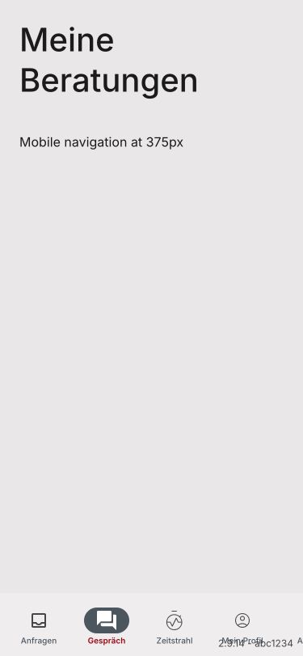
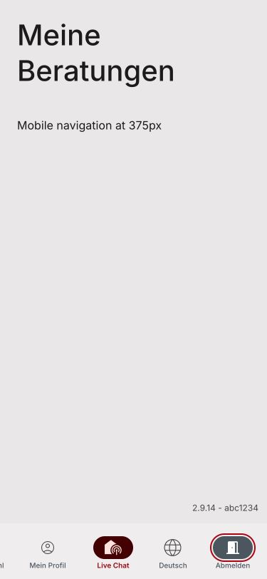

# Keep mobile build identity clear of navigation (#1683)

Phone users can read navigation labels without the build identity covering them. The identity moves above the mobile bar and includes the home indicator inset; desktop placement is preserved. The existing horizontal navigation remains scrollable with language and logout reachable.

Changed files: authenticatedApp.styles.scss and NavigationSidebar.stories.tsx plus this task and visual evidence.

Verification: local only, Node 22.23.3 and Chrome 375×812. Geometry test first reproduced version bottom 804 overlapping navigation top 734, then all seven navigation stories passed after the fix. Full unit gate: 701 files and 12,305 tests passed. Script lint, style lint and production build/postbuild also passed. Test evidence: [04-test-evidence.md](04-test-evidence.md).

Before (fixture identity overlaps labels):

After (version clears bar, language and focused logout visible after horizontal scrolling):

Reviewer plan: open Runtime Consultant Mobile 375 Shell in Storybook at Phone 375; confirm build identity stays above labels, horizontally scroll through routes/actions, then focus logout and press Enter. Desktop navigation stories should retain their vertical rail layout.

Limits: screenshots use a static identity fixture and no live backend. Navigation overflow is deliberate and retained. No auth, storage, network or privacy changes. Parent independent review passed. No PR opened by this subtask.
