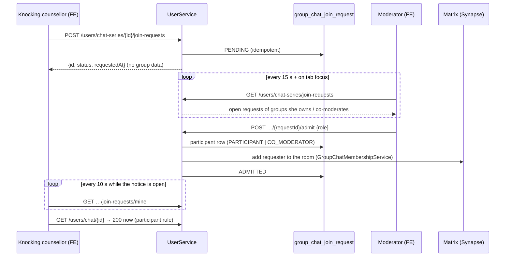

# Knock to join a self-help group (Gesprächskreis)

Status: proposed and implemented behind graceful degradation — ORISO-Frontend#1499, item 14
Date: 2026-09-23

## What this is

A counsellor who opens a self-help group through its invite link but is not part
of it sees "Sie sind nicht Teil dieses Gesprächskreises." (#1534). With this
change she can press **"Beitritt anfragen"**. The owner and co-moderators of the
group get a **join-request snackbar** (who is asking, from which Beratungsstelle
and Träger, via the invite link, when) with **Reinlassen / Ablehnen / Details**.
"Details" opens a popup with the full picture and the choice to admit as
participant or co-moderator. Several knocks stack.

Product rules (Frank, 23.09.2026):

1. Counsellors of **any Träger** who have the link may knock.
2. Until admitted they see **no group data** and cannot start, read or post.
   The knock carries only what the moderator needs: who is asking.
3. Old links without `aid` are not repaired.

## How a knock travels

## Options considered

### A. Matrix knocking (`join_rule: knock`, `m.room.member` membership `knock`, invite to admit)

Rejected, for five reasons measured against the code:

- **Wrong audience.** A knock is a room state event. Every member of the room
  sees it — including the advice seekers in the group. A counsellor of another
  Träger announcing herself to clients before anyone decided is exactly what rule 2
  forbids the other way round.
- **Wrong source of truth.** Who moderates a group is `group_chat_participant`
  in UserService (`OWNER | CO_MODERATOR | PARTICIPANT`), not Matrix power levels.
  Admitting through a Matrix invite would bypass it and need a reconciliation
  job; the server-side read check (`ChatPermissionVerifier`) would still refuse
  her the group.
- **No policy hook.** Matrix cannot express "any Träger may knock, but only the
  owner may grant co-moderation, and only to her own Träger". Anyone who knows
  the room id could knock, and nothing would log who decided.
- **Missing data.** Beratungsstelle and Träger of the knocking person are not
  in Matrix; the moderator snackbar needs them.
- **Migration.** Group rooms are created with the `private_chat` preset
  (`MatrixRoomClient`), i.e. `join_rule: invite`. Knocking needs room version
  ≥ 7 and a join-rule change on every existing group room.

### B. UserService endpoint + LiveService / STOMP websocket

Rejected: the LiveService was retired with Rocket.Chat (no chart, no ingress;
#1206, FE#1429 removes the dead socket). Resurrecting a relay for one feature is
the opposite of the direction the platform took.

### C. UserService endpoint as source of truth and authority; polling now, a Matrix to-device nudge later — **recommended and built**

- UserService owns the request, the authorization and the audit log.
- The frontend reaches it through one interface, `JoinRequestTransport`
  (`src/components/groupChat/joinRequest/joinRequestTransport.ts`). Today's
  implementation (`httpJoinRequestTransport`) polls: the moderator list every
  15 s and on tab focus, the knocking counsellor's own request every 10 s while
  her notice is open. A server without the endpoints (404) stops the poll for
  good and the notice stays what #1534 shipped.
- Low latency later without touching any caller: when the feed-update signal
  lands (Matrix to-device `org.oriso.feed.updated`, ADR-020 draft, US#1176 /
  FE#1456), UserService sends it to the moderators on a new request and to the
  requester on a decision; the transport answers it with an immediate poll.
  Matrix carries only "something changed" — never content, never the knock.

## Authorization

| Action | Who | Server rule |
| --- | --- | --- |
| Knock | any consultant with the link, any Träger — **self-help groups only** | 400 for an internal team chat (the app never offers the knock there: `knockableGroupId`); 409 if she already has access; idempotent while PENDING |
| See own request | the knocking counsellor | status only — no title, members, times of the group |
| List open requests | OWNER and CO_MODERATOR of that group | only groups with a participant row of the caller in one of these roles |
| Admit as participant | OWNER, CO_MODERATOR | 403 for PARTICIPANT or unrelated consultants; 409 unless PENDING |
| Admit as co-moderator | OWNER only, requester of the owner's Träger | mirrors `GroupChatParticipantReconciliationService`; 403 / 400 |
| Decline | OWNER, CO_MODERATOR | 409 unless PENDING |
| Read the group afterwards | the admitted counsellor | one new rule in `ChatPermissionVerifier.verifyPermissionForChat`: a participant of the series passes (read, join, members, leave, message-read). `verifyCanModerateChat` is unchanged, and start/stop go through `requireCanModerate` — an admitted participant cannot start the group |

Groups created before the participant table (no participant rows) are not
listed and cannot be admitted into (409) — there is no session to attach the
new participant to. Outsiders get 403 before any 404, so request ids do not leak.

Server side: ORISO-UserService#1243 (branch `feat/1499-group-chat-join-requests`,
table `group_chat_join_request`, Liquibase changeset `20260923_group_chat_join_request_1499`).

Knocking is a narrow, explicit exception: the knock endpoints never return group
content, and the read path only opens after a moderator admitted her. This must
stay compatible with the cross-tenant read fix (`fix/group-chat-cross-tenant-read`,
UserService) — the participant rule is the one coordination point.

## Audit and logging

Every transition is logged at INFO with request id, series id, actor and
requester consultant id and from→to status — no names, no titles. The table
keeps `decided_by` and `decided_at`. Observability follows the project rule:
OpenTelemetry signals to SigNoz, never Sentry.

## Frontend pieces

| Piece | File | Storybook |
| --- | --- | --- |
| Stacked snackbar host (app-wide) | `m3Snackbar/M3SnackbarHost.tsx`, `snackbarStack.ts` | Molecules/M3Snackbar/Stack |
| Join-request snackbar (child variant) | `groupChat/joinRequest/JoinRequestSnackbar.tsx` | Molecules/M3Snackbar/Join request |
| Details popup | `groupChat/joinRequest/JoinRequestDialog.tsx` | Molecules/M3Snackbar/Join request |
| Moderator wiring | `groupChat/joinRequest/JoinRequestCenter.tsx` (mounted in `AuthenticatedApp` for consultants) | Group chat/Knock to join (stage) |
| Knocking counsellor | `GroupChatNotMember.tsx` + `useOwnJoinRequest.ts` (wired in `SessionView`) | Group chat/Not a member |
| Transport | `joinRequestTransport.ts`, `httpJoinRequestTransport.ts`, `fakeJoinRequestTransport.ts` | — |

Stack decisions: newest at the bottom edge (where M3 puts the single snackbar),
older ones above, read oldest → newest (first come, first served); beyond three
on desktop / two on a phone the oldest fold into "+N weitere anzeigen", the
newest never hides. Desktop bottom-start over the list column (never over the
composer), phone above the navigation bar. The standing recovery notice
(`yieldToOthers`) steps aside while the stack shows anything.

## Open questions

See the PR description; they are Frank's to decide.
