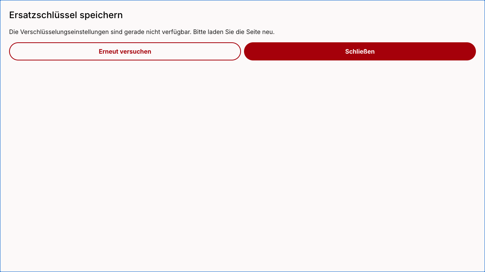

# Recovery dialog missing-catalogue fallback

The actual recovery dialog now labels its close action “Schließen” when the existing translation key is unavailable. The retry action and close callback are unchanged.




For developers — controlled local proof and limits:

```text
Actual BackupKeyAfterTwoFactorDialog rendered in Storybook with an isolated
empty German catalogue, clientOverride=null and open=true. No network/backend,
account, tenant or key data was used. The existing unavailable-client error
produced the visible retry and close actions. Before capture used only the
published Close fallback; after restored the independently reviewed Schließen
source. Temporary proof story removed and source hash restored afterwards.
These screenshots demonstrate missing-key copy only. The existing error/close
callback and unchanged recovery behavior are verified by focused unit tests.
No real 2FA/recovery enrollment, received mail or deployed acceptance claimed.
```
