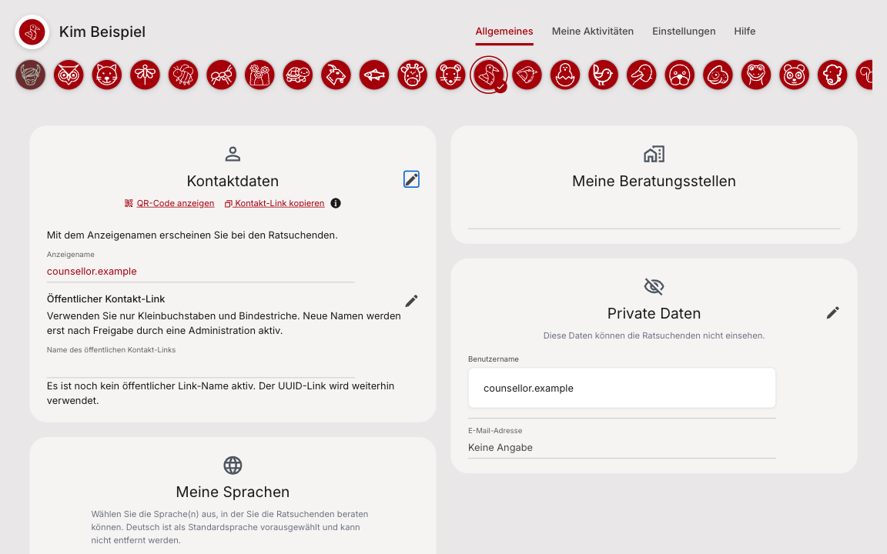
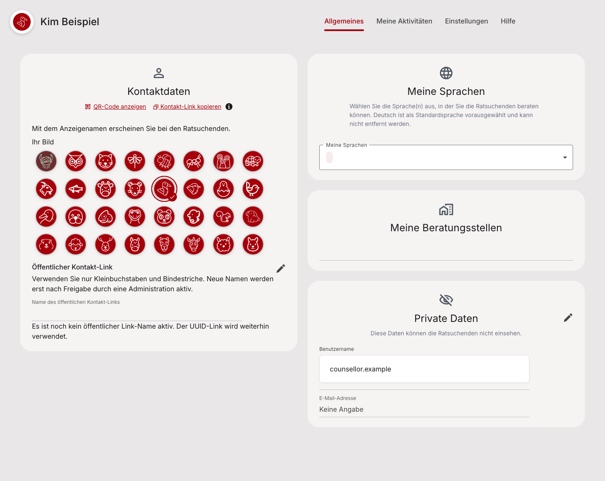

# Profile avatar placement evidence

The profile showed a large avatar row above every tab. The selection now stays in the existing General card: Contact data for counsellors and About me for askers. The compact profile avatar remains in the header.

The after image also includes the separate security and privacy work from PR1664. It shows the combined General page without folding that implementation into this PR. Both images use synthetic local Storybook data, not a deployed environment.

## Before



The picture shows the previously saved magpie after the story selected it. The giant global row was rejected in the later design review.

**For developers — exact source and capture state:**

```text
Stage/result: BEFORE / FAIL (rejected layout)
Surface: counsellor General profile; global header chooser
Logical viewport: 1440x900; DE; local Storybook/mock API
Captured source: ca0730637ecabff83e3c5d86e7641cdae8c5972a
PNG dimensions: 1152x720 (iframe-fit capture)
```

## After



The picture shows the saved magpie in the existing Contact data card. The separate display-name move is included from PR1664. Keyboard behavior, exact chat-author matching, cached reads and clearing to Standard are covered by tests; a still image does not prove those behaviors.

**For developers — integration dependency and capture state:**

```text
Stage/result: AFTER / PASS (local combined visual checks)
Surface: counsellor General profile; no global header chooser
Logical viewport: 1440x900; DE; local Storybook/mock API
PNG dimensions: 1440x1146 (full-page capture)
Local combined capture: 74c7777abc01980a4c5862adfbbf2828f1397cff
Avatar input (PR1468): 82950c8ad82d4d7376a151e96bbc67836b2aaef0
Settings input (PR1664): 0735860cc82844907c764ddc2f83089d2b281523
This evidence-only commit changes no production source.
The combined capture is not the head of this PR and is not Dev acceptance.
```

## Review

- Open General as a counsellor or asker. The avatar grid should appear inside the existing role-specific card.
- Open Settings. The global avatar chooser should be absent.
- Select Standard. It should save a derived animal; an explicitly stored administrator initials choice should remain initials until cleared.

Related: [Frontend1662](https://github.com/OpenResilienceInitiative/ORISO-Frontend/issues/1662), [PR1468](https://github.com/OpenResilienceInitiative/ORISO-Frontend/pull/1468), [PR1664](https://github.com/OpenResilienceInitiative/ORISO-Frontend/pull/1664), and the original placement in [Frontend1540](https://github.com/OpenResilienceInitiative/ORISO-Frontend/issues/1540).
