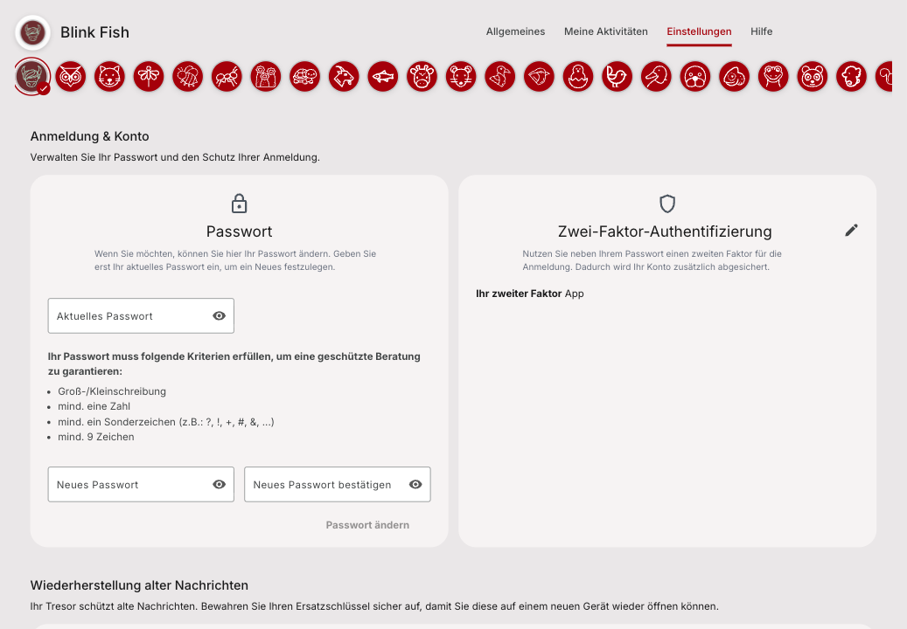
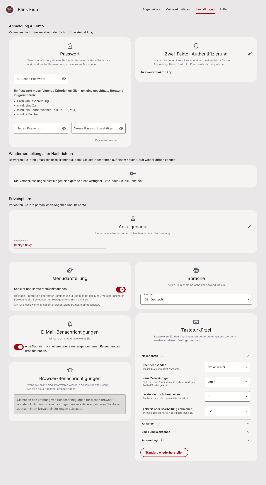

The security and privacy page keeps the approved profile cards. Cards keep their natural height, edit pencils stay clear of translated headings, and recovery keeps the existing password/recovery-key wording. The three ordered groups and their existing actions remain in place.

The after picture shows the complete page with the separate avatar correction included in a local integration checkout. This pull request contains the grouped-settings correction; the full-page result also requires the avatar dependency. Both screenshots use synthetic Storybook data. They do not prove deployment or live Dev acceptance.





**For developers — capture provenance and limits:**

```text
Before: FAIL / rejected layout; DE; local Storybook/mock API.
Browser viewport1440x1000; source81a7509867463164feff4dfc1c5beb5fb0a29b90.
After: PASS / combined page; DE; local Storybook/mock API.
Browser viewport1440x900; full-page PNG1440x2623.
Grouped settings:5ebfab0599d3e22a6ce62159921f5fb19dbf3828 (PR1664).
Avatar dependency:82950c8ad82d4d7376a151e96bbc67836b2aaef0 (PR1468).
Local integration merge:ade0b32bd70a5ecec591f7aa66795434805b7428.
The integration merge is not the head of this pull request.
These files add evidence only; production source remains 5ebfab05.
The full-page recovery card shows unavailable/mock (no crypto engine fixture),
not a healthy recovery state or live environment failure.
The pending-save guard is verified by deferred-promise tests, not this still image.
Passwords/recovery inputs are empty; names are synthetic.
```

**For developers — local validation:**

```text
Final production source 5ebfab05: Node 22.12 full unit run, 667 files / 11814 tests PASS.
Final affected units:38files /273tests;Storybook interactions+axe:3files /23tests PASS.
Final affected ESLint/stylelint, app+Storybook types, production build and host guard PASS.
Combined roles ×390/820/1440×General/Settings:12checks PASS;4StoryFiles/27tests PASS.
Final combined merge ade0b32b: 4 Storybook files / 27 interactions+a11y tests PASS.
DE both roles at 390x844 / 820x1180 / 1440x900; EN counsellor all three widths PASS.
Privacy pencil keyboard focus visible; editor opens and cancels.
Display-name duplicate-save RED: two PATCH calls before React commits.
GREEN: one PATCH while pending; re-edit works after success and failure.
Node 22 affected regression probe: 5 files / 56 tests PASS.
An earlier host Node 24 run failed 18 tests in untouched Practice/Help files.
The same source passed all 11814 tests after restoring the prior Node 22 runtime.
Native-language review of new translations, especially Tigrinya, remains open.
```
