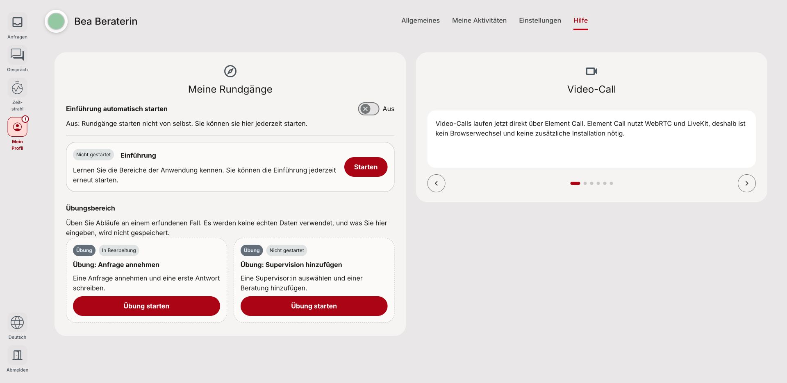

# End practice resets progress (#1680)

Local Chrome screenshots of `Organisms/PracticeFlow → End resets an interrupted exercise`, using a stateful mock of the tutorial-progress API and fictional practice data.

- **Before:** the original banner End handler returns to Help but the card remains “In Bearbeitung”.
- **After:** the fixed End handler resets progress and the restored card reads “Nicht gestartet”.

These images show the visible card status after End. Unit/integration tests prove reset ordering, rejection cleanup and login isolation; screenshots do not establish those properties or live backend behavior.

## Before

## After

