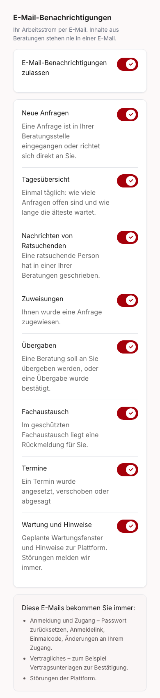
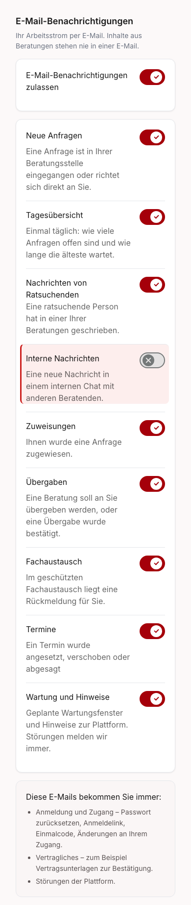

# Internal counsellor-chat mail preference — local evidence

The new internal-chat switch is separate from protected feedback and browser choices. Its own mail footer opens and highlights this setting. Explicit opt-out survives local save and reload; older absent/null values display the backend's enabled default.

Delivery package: [UserService1375](https://github.com/OpenResilienceInitiative/ORISO-UserService/issues/1375), under [Frontend828](https://github.com/OpenResilienceInitiative/ORISO-Frontend/issues/828). No duplicate Frontend issue was created.

These are synthetic local Storybook screenshots, not Dev users or received-mail proof. The baseline renders eight occasion switches plus the mail master switch. The repaired counsellor list has nine occasion switches plus the master; advice seekers retain their separate three-occasion list. Before screenshots use the clean original source. After screenshots show the saved opt-out in the local PATCH/GET fixture. Permission, focus and browser-notification rules remain independent.

**For reviewers — immutable source and validation details:**

```text
Before source: b527b8bc6fea723b2ca59ec73f57127debb022f9
After code and screenshots: 1ed5b02efe6ccd304b284a3acffd2c1da3fdf0db
After evidence layer: local-dev, Storybook127.0.0.1:6038
Before evidence layer: local-dev, Storybook127.0.0.1:6039
Both servers and the extra baseline worktree are stopped/removed after capture.
Node22.12.0; no backend deployment or CI result claimed.

npm run test:unit:665 files/11806 tests passed
npm run lint:scripts:PASS (ESLint and app typecheck)
npm run lint:style:PASS
npm run build:PASS, postbuild forbidden-host scan PASS
npm run typecheck:storybook:PASS
Scoped Storybook browser/axe:7 cases passed
Internal-chat and appointment Playwright browser tests:10 cases passed
Internal-chat matrix:DE/EN/RU ×390x844,820x1180,1440x900
WCAG2A/2AA/2.1AA/2.2AA:zero violations in each internal-chat matrix row
Keyboard:focusable switch, Space updates stored choice; reload reads saved false
No clipping of the internal-chat row at tested viewport widths

Canonical UserService DTO regenerated using dtsgen.ts from the reviewed schema.
api/userservice.yaml SHA256:
e8a0954ec7ab778740a8e8bdbf65391932b62115a74d7db1fead1d34669dd3e7
Existing generated-file drift adds already-present API definitions; no manual final type edit.
```

The first full unit run caught redundant neutral German in the sparse informal overlay; removing those duplicate additions fixed the existing guard. The browser harness coordinates with an already-running Storybook axe scan, then asserts its result without retrying violations. Both corrections were followed by green runs. Missing local Husky bootstrap was restored with the normal prepare command; commit hooks were not bypassed.

**For reviewers — reproduce the local preference and accessibility checks:**

```sh
npm run storybook -- --host 127.0.0.1 --ci --no-open
# Use the actual local port printed by Storybook (normally6006).
PLAYWRIGHT_BASE_URL=http://127.0.0.1:6006 npx playwright test \
  playwright/internal-chat-preferences.smoke.spec.ts \
  playwright/self-help-appointment-preferences.smoke.spec.ts \
  --project chromium --workers=1
npx vitest run --project storybook \
  src/components/profile/EmailNotifications/EmailNotifications.stories.tsx \
  --maxWorkers=1 --minWorkers=1
```

Local preview: `/iframe.html?id=organisms-emailnotificationsettings--counsellor-internal-chat-preference&viewMode=story`. Hosted Storybook/MCP preview tools were unavailable in this execution; no hosted result is claimed. Actual Dev onboarding, encrypted chat readability, mail receipt, merge and rollout are separate acceptance gates.

## Screenshot index

Each image is full-page capture at the stated viewport. PASS describes the observed local UI state; screenshots alone do not prove persistence or delivery. Browser tests establish save/reload and keyboard behavior.

| Stage and surface                    | Viewport | Locale | Layer     | Source                                     | Result and image                                                                      |
| ------------------------------------ | -------- | ------ | --------- | ------------------------------------------ | ------------------------------------------------------------------------------------- |
| before: baseline counsellor settings | 1440x900 | de     | local-dev | `b527b8bc6fea723b2ca59ec73f57127debb022f9` | PASS: [baseline control absent](01-before-local-desktop-de-baseline-settings.png)     |
| before: baseline counsellor settings | 1440x900 | en     | local-dev | `b527b8bc6fea723b2ca59ec73f57127debb022f9` | PASS: [baseline control absent](01-before-local-desktop-en-baseline-settings.png)     |
| before: baseline counsellor settings | 1440x900 | ru     | local-dev | `b527b8bc6fea723b2ca59ec73f57127debb022f9` | PASS: [baseline control absent](01-before-local-desktop-ru-baseline-settings.png)     |
| before: baseline counsellor settings | 390x844  | de     | local-dev | `b527b8bc6fea723b2ca59ec73f57127debb022f9` | PASS: [baseline control absent](01-before-local-mobile-de-baseline-settings.png)      |
| before: baseline counsellor settings | 390x844  | en     | local-dev | `b527b8bc6fea723b2ca59ec73f57127debb022f9` | PASS: [baseline control absent](01-before-local-mobile-en-baseline-settings.png)      |
| before: baseline counsellor settings | 390x844  | ru     | local-dev | `b527b8bc6fea723b2ca59ec73f57127debb022f9` | PASS: [baseline control absent](01-before-local-mobile-ru-baseline-settings.png)      |
| before: baseline counsellor settings | 820x1180 | de     | local-dev | `b527b8bc6fea723b2ca59ec73f57127debb022f9` | PASS: [baseline control absent](01-before-local-tablet-de-baseline-settings.png)      |
| before: baseline counsellor settings | 820x1180 | en     | local-dev | `b527b8bc6fea723b2ca59ec73f57127debb022f9` | PASS: [baseline control absent](01-before-local-tablet-en-baseline-settings.png)      |
| before: baseline counsellor settings | 820x1180 | ru     | local-dev | `b527b8bc6fea723b2ca59ec73f57127debb022f9` | PASS: [baseline control absent](01-before-local-tablet-ru-baseline-settings.png)      |
| after: appointment preference        | 1280x720 | de     | local-dev | `1ed5b02efe6ccd304b284a3acffd2c1da3fdf0db` | PASS: [enabled reference](01-local-counsellor-appointments-enabled.png)               |
| after: internal-chat saved opt-out   | 1440x900 | de     | local-dev | `1ed5b02efe6ccd304b284a3acffd2c1da3fdf0db` | PASS: [new control highlighted and off](02-after-local-desktop-de-saved-opt-out.png)  |
| after: internal-chat saved opt-out   | 1440x900 | en     | local-dev | `1ed5b02efe6ccd304b284a3acffd2c1da3fdf0db` | PASS: [new control highlighted and off](02-after-local-desktop-en-saved-opt-out.png)  |
| after: internal-chat saved opt-out   | 1440x900 | ru     | local-dev | `1ed5b02efe6ccd304b284a3acffd2c1da3fdf0db` | PASS: [new control highlighted and off](02-after-local-desktop-ru-saved-opt-out.png)  |
| after: internal-chat saved opt-out   | 390x844  | de     | local-dev | `1ed5b02efe6ccd304b284a3acffd2c1da3fdf0db` | PASS: [new control highlighted and off](02-after-local-mobile-de-saved-opt-out.png)   |
| after: internal-chat saved opt-out   | 390x844  | en     | local-dev | `1ed5b02efe6ccd304b284a3acffd2c1da3fdf0db` | PASS: [new control highlighted and off](02-after-local-mobile-en-saved-opt-out.png)   |
| after: internal-chat saved opt-out   | 390x844  | ru     | local-dev | `1ed5b02efe6ccd304b284a3acffd2c1da3fdf0db` | PASS: [new control highlighted and off](02-after-local-mobile-ru-saved-opt-out.png)   |
| after: internal-chat saved opt-out   | 820x1180 | de     | local-dev | `1ed5b02efe6ccd304b284a3acffd2c1da3fdf0db` | PASS: [new control highlighted and off](02-after-local-tablet-de-saved-opt-out.png)   |
| after: internal-chat saved opt-out   | 820x1180 | en     | local-dev | `1ed5b02efe6ccd304b284a3acffd2c1da3fdf0db` | PASS: [new control highlighted and off](02-after-local-tablet-en-saved-opt-out.png)   |
| after: internal-chat saved opt-out   | 820x1180 | ru     | local-dev | `1ed5b02efe6ccd304b284a3acffd2c1da3fdf0db` | PASS: [new control highlighted and off](02-after-local-tablet-ru-saved-opt-out.png)   |
| after: appointment preference        | 1280x720 | de     | local-dev | `1ed5b02efe6ccd304b284a3acffd2c1da3fdf0db` | PASS: [saved disabled reference](02-local-counsellor-appointments-saved-disabled.png) |




